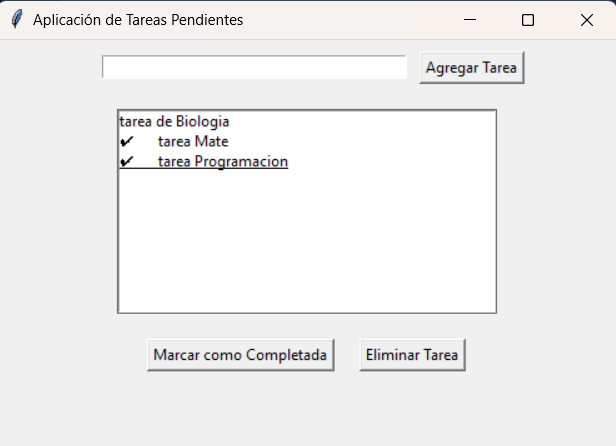

# Aplicacion de administracion de tareas

Este repositorio hace es correr un codigo que desprende una ventana de un administrador de tareas 

## Modo de uso
Se debe de tener la biblioteca de tkinter para poder usar este codigo y se usa con el comando "py AplicacionTareas.py clase7"en el directorio de  ".\clase7"

## Ejemplo de uso 
"